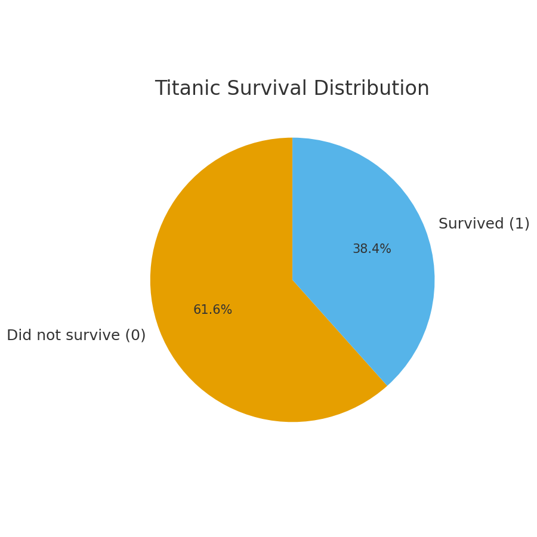

# 🛳️ Titanic Survival Analysis & Prediction

**Author:** Arame Tanor Deme  
**Focus:** Data Analytics • Predictive Modeling • Visualization  
**Stack:** Python • Pandas • Matplotlib • Scikit-learn • Google Colab

---

## 🎯 Overview
This project explores the Titanic dataset to understand which factors influenced survival and builds a logistic regression model to predict whether a passenger survived. It demonstrates the full analytics pipeline from cleaning and feature engineering to visualization and model evaluation.

---

## ⚙️ Pipeline
- **Import & Clean**: Handle missing values; standardize key fields.
- **Feature Engineering**: `SexNum`, `FamilySize`, `IsAlone`, `AgeBand`, `Embarked` dummies.
- **EDA**: Survival distributions and segmented survival rates.
- **Modeling**: Logistic Regression to predict `Survived`.
- **Evaluation**: Accuracy, ROC AUC, and Confusion Matrix.

---

## 📊 Key Visuals

### Survival Distribution


### Survival Rate by Sex


### Survival Rate by Passenger Class


### Survival Rate by Age Band


### Confusion Matrix (Model Evaluation)


---

## 🧠 Model Performance
- **Accuracy:** 0.785  
- **ROC AUC:** 0.848

**Confusion Matrix:**
```
[[115  22]
 [ 26  60]]
```

**Interpretation:**
- **True Positives**: Correctly predicted survivors
- **True Negatives**: Correctly predicted non-survivors
- **False Positives**: Predicted survival but passenger did not survive
- **False Negatives**: Missed actual survivors

---

## Data-Driven Takeaways

- 📊 Class Inequality: 1st-class passengers had the highest survival rate → equitable lifeboat access could have saved more in lower classes.
- 👩🏾‍🦱 Gender Impact: Females survived at far greater rates → structured, inclusive evacuation protocols needed.
- 👨‍👩‍👧‍👦 Family Advantage: Larger families fared better → coordinated group strategies increase rescue chances.
- 🧍‍♀️ Isolation Risk: Solo travelers had lower survival → pairing or group assignments improve safety.
- 💰 Economic Bias: Higher fares correlated with survival → survival should depend on readiness, not wealth.

---


